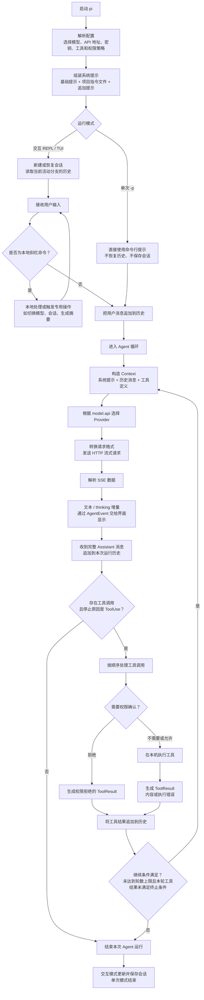
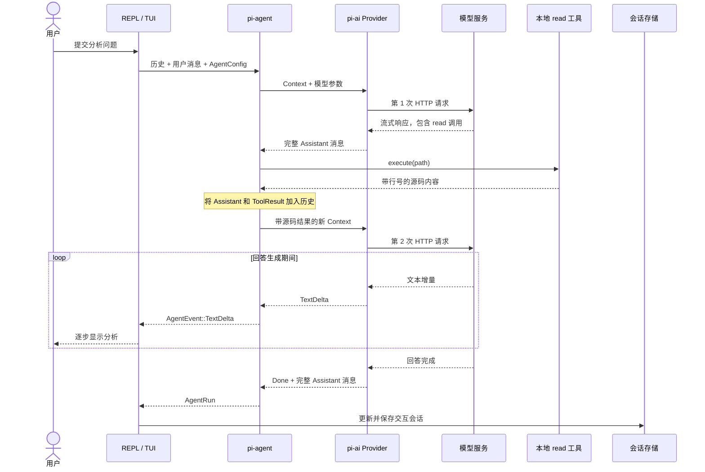

# 从用户输入到模型输出：Pi Rust 执行流程

> 本文依据当前仓库源码整理。描述的是实际代码路径，不代表所有模型服务能力都经过真实 API 验证。

## 1. 核心结论

用户的一次输入，不一定只对应一次模型请求。如果模型需要读文件、搜索或执行命令，程序会执行工具，再把结果发送给模型；直到模型给出最终回答，或运行被中断、出错、达到轮数上限。

三层代码分别负责：

| Crate | 职责 |
| --- | --- |
| `pi-coding-agent` | 用户输入、配置、系统提示、REPL/TUI、会话管理和展示 |
| `pi-agent` | 模型调用循环、工具执行、权限检查、运行事件和停止条件 |
| `pi-ai` | 各模型服务的请求转换、HTTP 通信、SSE 解析和统一消息类型 |

## 2. 完整流程图

以下流程图使用 Mermaid，可在支持 Mermaid 的 Markdown 阅读器中渲染。



图中展示正常主路径。Provider 报错、取消等情况可能提前退出，并不保证都能走到正常的结束和保存路径。交互模式完成一轮后仍可继续接收下一次用户输入。

工具的终止条件还有一个实现细节：本轮执行的工具必须全部返回 `terminate=true`，循环才会因工具终止条件停止。普通工具结果默认不要求终止；权限拒绝和执行错误也不会满足这一条件。

## 3. 用户按下 Enter 后，具体发生了什么？

### 第一步：应用层接收输入

入口属于 `pi-coding-agent`：

- REPL 从终端读取输入。
- TUI 从输入缓冲区取得用户提交的文本。
- `-p` 模式直接使用命令行参数。

交互输入先经过命令分流。例如 `/model`、`/tree` 通常由程序处理，不会作为普通用户问题原样发给模型；`/compact` 则会触发专用的摘要请求。不同交互界面的命令处理路径并非完全相同。

普通输入被包装为统一消息，概念上如下：

```rust
Message::User {
    content: vec![Content::Text { text: user_input }],
    timestamp: now_ms(),
}
```

随后，这条用户消息与当前活动分支的历史一起交给 `run_agent_with_history()`。

源码位置：

- [CLI 入口](crates/pi-coding-agent/src/main.rs)
- [REPL 输入处理](crates/pi-coding-agent/src/interactive.rs)
- [TUI 输入处理](crates/pi-coding-agent/src/tui.rs)
- [Agent 历史入口：agent_loop.rs:35](crates/pi-agent/src/agent_loop.rs#L35)

### 第二步：组装模型真正看到的上下文

模型收到的并不只是刚输入的那句话，而是三类内容：

| 内容 | 实际作用 |
| --- | --- |
| 系统提示 | 描述助手职责，并包含加载的项目指令等 |
| 历史消息 | 当前分支上的用户消息、模型回答、工具调用和工具结果 |
| 工具定义 | 告诉模型有哪些工具、用途是什么、参数应是什么结构 |

Agent 中的实际构造代码为：

```rust
let ctx = Context {
    system_prompt: Some(config.system_prompt.clone()),
    messages: messages.clone(),
    tools: tool_defs.clone(),
};
```

模型不会自动看见整个仓库。项目指令文件可以被预先加入提示，但普通源码通常需要通过 `read`、`grep`、`find` 等工具读取后，才会进入上下文。

恢复树形会话时，传入的是当前活动路径上的消息，不是整棵会话树。

源码位置：

- [Context 构造：agent_loop.rs:64](crates/pi-agent/src/agent_loop.rs#L64)
- [系统提示组装](crates/pi-coding-agent/src/system_prompt.rs)
- [项目指令加载](crates/pi-coding-agent/src/project.rs)
- [活动分支还原：session.rs:123](crates/pi-coding-agent/src/session.rs#L123)

### 第三步：转换成模型服务的请求

`pi_ai::stream_simple()` 根据 `model.api` 分派：

```text
anthropic-messages    → Anthropic Messages
openai-completions    → OpenAI Chat Completions
openai-responses      → OpenAI Responses
google-generative-ai → Google Gemini
```

Provider 负责：

1. 将统一消息转换成服务商要求的 JSON。
2. 加入模型 ID、密钥、请求头和其实现支持的生成参数。
3. 发送 HTTP 请求。
4. 将 SSE 响应转换回统一事件。

因此，消息历史和工具读取到的内容会随请求发送到配置的模型服务地址。

统一类型支持某项能力，不代表每个 Provider 都完整实现了这项能力。例如 reasoning、图片、用量和停止原因的映射在不同实现中并不一致。

源码位置：[Provider 分派：lib.rs:33](crates/pi-ai/src/lib.rs#L33)。

### 第四步：边接收，边显示

模型响应流式到达，不必等整段回答完成：

```text
模型服务发送 SSE 数据
        ↓
Provider 解析为 TextDelta / ThinkingDelta 等事件
        ↓
Agent 转发为 AgentEvent
        ↓
REPL / TUI / JSON 输出层消费事件
        ↓
按输出模式逐步展示或输出数据
```

这里必须区分三个时刻：

- **显示**：收到增量就可以显示，具体展示方式取决于界面。
- **工具执行**：等待完整 assistant 消息，再检查其中的工具调用。
- **会话保存**：已经显示，不等于已经完整落盘。

Agent 在收到 `Done` 后取得完整 assistant 消息，将其加入本次运行历史，再决定是否执行工具。

源码位置：[流式事件处理：agent_loop.rs:80–118](crates/pi-agent/src/agent_loop.rs#L80)。

### 第五步：模型请求工具，程序负责执行

例如模型请求读取文件。以下仅表示工具名称和参数，不是某个 Provider 的完整原始响应：

```json
{
  "name": "read",
  "arguments": {
    "path": "crates/pi-agent/src/agent_loop.rs"
  }
}
```

此时执行文件读取的是本地 Rust 程序，不是远端模型。

Agent 会：

1. 根据名称找到注册的 `AgentTool`。
2. 检查工具是否需要权限，以及本次运行是否已经允许该工具。
3. 如需确认，调用 `PermissionPolicy::check()`。
4. 允许后调用 `tool.execute(...)`。
5. 将内容或执行错误包装为 `ToolResultMessage`。
6. 将结果追加到历史。

权限拒绝也会形成错误工具结果反馈给模型，模型可以换一种方法或向用户解释。

同一条 assistant 消息中的多个工具调用按顺序执行，没有并行调度。工具执行能力来自本机文件系统、进程和网络；权限确认本身不是操作系统沙箱。

源码位置：

- [权限与工具执行：agent_loop.rs:138–215](crates/pi-agent/src/agent_loop.rs#L138)
- [工具与权限接口：types.rs:39](crates/pi-agent/src/types.rs#L39)
- [默认工具注册](crates/pi-agent/src/tools/mod.rs)

### 第六步：带着工具结果再次请求模型

工具执行完成后，程序重新构造上下文并请求模型。

此时历史可能是：

```text
User：请分析 agent_loop.rs
Assistant：调用 read 工具
ToolResult：agent_loop.rs 的文件内容
```

模型此时才看到了实际源码，可以回答，也可以继续请求其他工具。

每轮都会带上累积的当前分支历史，而不只是发送最新的工具结果。这也是多轮工具调用会增加输入 token 和上下文长度的原因。

### 第七步：结束并保存

如果没有工具调用，或者停止原因不是 `ToolUse`，Agent 正常结束并返回 `AgentRun`。

交互层随后更新会话并保存；`-p` 模式不保存会话。

达到 `max_turns` 也会停止。`AgentConfig::new()` 的默认值是 **32 轮模型调用**，不是 32 条用户输入，也不是 32 次工具执行。调用方可以覆盖这个值。

对于错误退出，运行过程不保证发出与正常结束完全相同的生命周期事件；因此不能把上面的保存步骤当作所有异常情况下的保证。

源码位置：

- [停止判断与返回：agent_loop.rs:217–236](crates/pi-agent/src/agent_loop.rs#L217)
- [默认配置：types.rs:92](crates/pi-agent/src/types.rs#L92)
- [单次输出模式](crates/pi-coding-agent/src/print_mode.rs)

## 4. 具体示例：一次输入，两次模型请求

用户输入：

> 分析 `agent_loop.rs`，说明工具是怎么执行的。

假设模型选择读取文件，实际交互如下：



这个例子中：

- 用户输入一次。
- 模型调用两次。
- 本地工具执行一次。

如果模型已有足够上下文，可以直接回答；如果需要更多文件，则继续执行“请求模型—执行工具—反馈结果”的循环。

## 5. 关键源码索引

| 阶段 | 源码 |
| --- | --- |
| CLI 启动和模式分流 | [main.rs](crates/pi-coding-agent/src/main.rs) |
| 配置与模型选择 | [config.rs](crates/pi-coding-agent/src/config.rs) |
| 系统提示组装 | [system_prompt.rs](crates/pi-coding-agent/src/system_prompt.rs) |
| REPL 交互 | [interactive.rs](crates/pi-coding-agent/src/interactive.rs) |
| TUI 交互 | [tui.rs](crates/pi-coding-agent/src/tui.rs) |
| 会话树与持久化 | [session.rs](crates/pi-coding-agent/src/session.rs) |
| Agent 核心循环 | [agent_loop.rs](crates/pi-agent/src/agent_loop.rs) |
| 工具、权限、事件接口 | [types.rs](crates/pi-agent/src/types.rs) |
| Provider 分派 | [lib.rs](crates/pi-ai/src/lib.rs) |
| 统一模型消息和流式事件 | [types.rs](crates/pi-ai/src/types.rs) |
| HTTP 重试 | [retry.rs](crates/pi-ai/src/retry.rs) |

## 6. 当前实现边界与验证范围

理解主流程时还应注意：

- 工具串行执行；工具开始执行前需等待完整 assistant 消息。
- 取消属于检查点式处理，HTTP 请求和静默 SSE 等待期间不保证即时中断。
- 各 Provider 对 reasoning、用量和终态等的支持并不一致。
- TUI 中的异步摘要回写、会话切换和中途退出保存存在状态一致性缺口。
- 手动 compact 会重建消息历史，不等于自动、无损地管理上下文窗口。

本次仓库分析期间执行了：

```bash
cargo test --workspace --all-features
```

Windows 环境下 **73 项测试执行通过，0 失败**。这个数量包含部分会话测试在不同测试目标中的重复执行，不代表 73 个独立场景。没有调用真实模型 API，因此不能据此认定所有 Provider 已通过端到端验证。

## 总结

这个项目不是把用户输入直接转发给模型的聊天客户端，而是一个维护会话历史、解析模型决策、执行本地工具，再将执行结果反馈给模型的循环控制程序。

模型负责生成内容和提出工具调用；本地 Agent 负责检查权限、执行工具、维护历史和控制循环；应用层负责输入、显示与会话管理。
